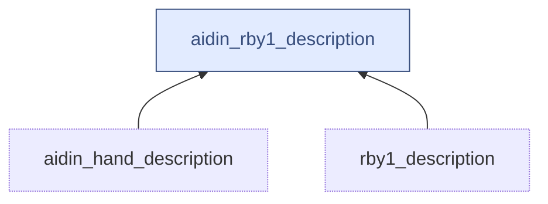
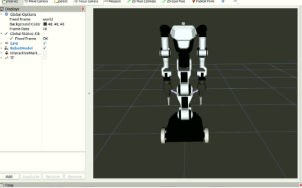
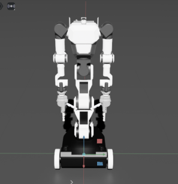
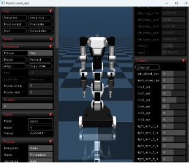

# aidin_rby1_description

<!-- Variables -->
- Version 1.0.0

---

<div style="display:flex;">
<div style="flex:50%; padding-right:10px; border-right: 1px solid #dcdde1">

**Package summary**

This module provides models for RB-Y1 with Aidin Hands.

- Maintainer status: maintained
- Author
  - Jeongmin Jeon (jm.jeon@aidinrobotics.co.kr)

</div>
<div style="flex:40%; padding-left:10px;">

**Table of Contents**
- [aidin\_doosan\_calibration](#aidin_doosan_calibration)
  - [Overview](#overview)
  - [Installation methods](#installation-methods)
    - [Install manually](#install-manually)
  - [Dependencies](#dependencies)
    - [Frameworks](#frameworks)
    - [ROS packages](#ros-packages)
  - [Quick start](#quick-start)
    - [Tutorial](#tutorial)

</div>
</div>

---

## Overview

This module provides following modules:



## Installation methods

### Install manually

1. Install the ROS2 humble. [Instructions for Ubuntu 22.04](https://docs.ros.org/en/humble/Installation/Ubuntu-Install-Debs.html)
2. Install ROS additional packages
  ```
  sudo apt-get install ros-humble-xacro
  ```

## Dependencies

### Frameworks

- ROS humble
  
### ROS packages

- aidin_hand_description([link](../../../aidin_hand_description))
- rby1_description([link](https://github.com/RainbowRobotics/rby1-ros2))


## Quick start 

### Tutorial

1. Run RVIZ

```bash
ros2 launch aidin_rby1_description description.launch.py use_joint_publisher:=true
```



This package also provides Isaac Sim USD files and Mujoco MJCF files in `model` folder.

|  |  |
|:----------------------------:|:----------------------------------:|
|        Isaac Sim USD         |         Mujoco MJCF                |


